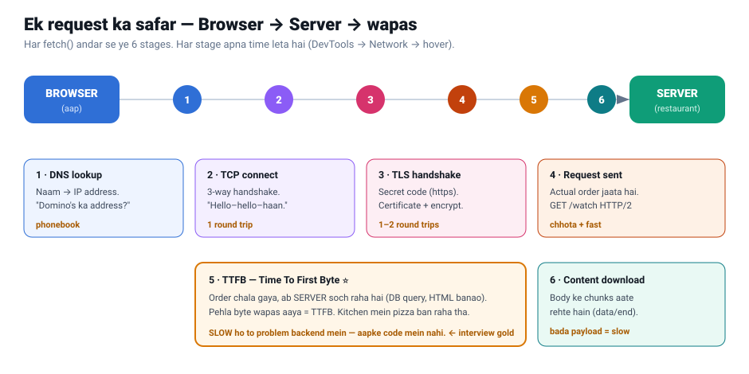
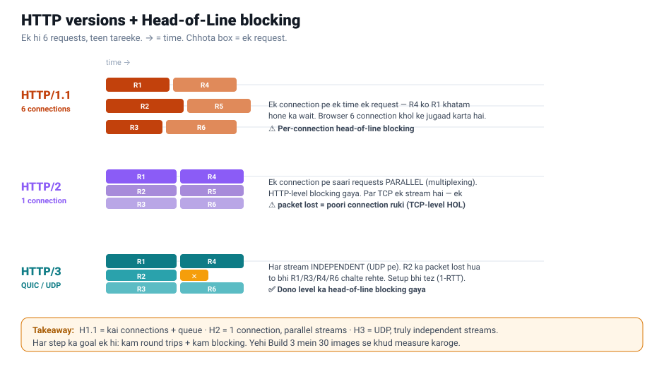

# Week 1 Notes — The Network

> Format: har build ke baad 3 line — **kya seekha / kis React kaam se juda / kyun ya bottleneck insight**.

## 🗺️ Concept recap — ek request ka safar



**6 stages:** DNS (naam→IP) → TCP (3-way handshake, 1 round trip) → TLS (secret code, 1–2 RT) → Request → **TTFB** (server soch raha) → Download.

**Best-note insights (HPBN — Grigorik):**
1. **Latency is king, not bandwidth.** Web pe zyadatar time *chhoti-chhoti cheezein* laane mein jaata hai (round trips), size mein nahi. Fat pipe help nahi karta agar har request ek nayi hello-hello kare.
2. **Har round trip mehnga hai.** TCP = 1 RT, TLS = 1–2 RT — data se *pehle* hi 2–3 trips lag gaye. Isiliye **connection reuse (keep-alive)** aur **HTTP/2 multiplexing** itne bade optimizations hain.
3. **TCP slow start:** connection dheere shuru hota hai (~14KB), phir har RTT pe double. Nayi connection = dheemi shuruaat. (Reuse = warm connection.)
4. **TTFB = server ka soch-time.** DevTools mein "Waiting (TTFB)" — slow = backend problem.

### Deep — round trips, latency, HTTP versions
- **RTT (round trip) = currency.** Distance = physics. Same-city ~1–20ms, cross-continent ~150–300ms. Cold `https` = ~4 RTT (DNS+TCP+TLS 1.2) *data se pehle*. Fix: CDN (paas laao) + reuse (count kam karo).
- **Latency vs bandwidth:** bandwidth = highway lanes (bade file); latency = length/speed (kai chhoti requests). Web = latency-bound.



- **HTTP/1.1:** kai connections (max ~6/origin) + per-connection queue → head-of-line blocking.
- **HTTP/2:** 1 connection, multiplexed parallel streams (HTTP-level HOL gaya). Par TCP ek stream — 1 packet lost = sab ruka (TCP-level HOL).
- **HTTP/3 (QUIC/UDP):** har stream independent + tez setup → dono level ka HOL gaya.

---

## 🧩 Code kaise chalta hai — `timing.js` ki mechanics (Node/JS)

> Ye "network concept" nahi, "code andar-andar kaise chalta hai" wala samajh. Iske bina code padhna confuse karta hai.

### 1. URL kahan se aata hai — command line argument
- Chalate hain: `node timing.js https://api.github.com` — URL code mein **likha nahi**, command se **bahar se** diya jaata hai.
- Node har command ko ek list `process.argv` mein todta hai:
  - `argv[0]` = `node` khud · `argv[1]` = file ka path · `argv[2]` = **pehla asli input (URL)**
- Isiliye `const url = process.argv[2]` se URL mil jaata hai. Ek file, alag URL → alag test.

### 2. Node file ko upar-se-neeche khud chalata hai
- `node file.js` = Node har **top-level line** turant chala deta hai. Koi `main()` call karne ki zarurat nahi — **file hi program hai**.
- `https.get(...)` aur `req.on(...)` — ye **khud function calls hain** (jaise `console.log()`), Node inhe top-to-bottom call kar deta hai.

### 3. Callback = "abhi mat chalo, event pe chalna" (event-driven)
- `.on(event, kaam)` ka matlab: **"jab ye event ho, tab ye kaam karo."** Kaam **abhi nahi** hota — event pe hota hai.
- `https.get(url, (res) => {...})` mein diya function turant nahi chalta — Node use **rakh leta hai**, response aane par **khud chalata hai**.
- 💡 Isiliye lagta hai "koi function call nahi kiya" — par callbacks network events pe khud chalte hain. (Ye Week 2 · Build 5 "event loop" ka base hai.)

### 4. Code-order ≠ run-order 🔑
- Code mein `https.get` block **upar**, `req.on("socket")` block **neeche** likha — iska matlab "pehle https chala" **NAHI**.
- Asal run order (network decide karta hai): **socket ke DNS → TCP → TLS pehle**, phir response ka **TTFB → download baad mein**.

### 5. Do alag block, kyun — `socket` vs `res`
- **Dabba 2 → `req.on("socket", socket => ...)`** = connection *banane* ke events → `lookup`(DNS), `connect`(TCP), `secureConnect`(TLS).
- **Dabba 1 → `https.get(url, res => ...)`** = jawaab *aane* ke events → `t("ttfb")`, `res.on("end")`(download).
- Yaad rakho: `res.on("data")`/`res.on("end")` **bahar nahi gaye** — woh `https.get` ke dabbe ke **andar** hain (closing `})` tak sab andar).

### 6. `socket` asal mein kya hai — telephone line 📞
- Socket = do computers ke beech ka **two-way pipe** — data **aata bhi, jaata bhi**, poore connection bhar.
- DNS/TCP/TLS to bas line **kholne** ke steps; uske baad socket ka asli kaam = **data ka aana-jaana**. (Week 5 WebSocket/SSE mein yahi kaam aayega.)

### 7. HTTPS, socket ke UPAR baithta hai (real layering) 🥪
```
HTTPS   ← "GET /users do", headers, JSON   (bhasha)
TLS     ← taala (encryption)
TCP/SOCKET ← asli taar, bytes ka aana-jaana (rasta)
```
- HTTPS khud data nahi bhejta — **neeche socket se** bhijwata hai. Socket = taar, HTTPS = us taar pe bhejne wali bhasha.
- Isiliye `https.get()` **andar hi socket banata hai** → socket events pehle fire hote hain.
- **Layering real hai** (har bhasha mein); `https.get` + `req.on("socket")` wali **shape Node ka tareeka** hai.

---

## Build 1 — Request timing logger
- **Kya seekha:** Ek request 5 stages mein tootti hai — DNS → TCP → TLS → TTFB → Download. `perf_hooks` se har event pe timestamp liya, consecutive difference = us stage ka time. Node event-driven hai: `https.get`/`req.on(...)` callbacks event pe khud chalte hain (code-order ≠ run-order). `socket` = connection banane ke events (DNS/TCP/TLS), `res` = jawaab aane ke events (TTFB/download). http mein TLS skip → ternary se handle kiya.
- **React/JS se juda:** Yehi 5 bars Chrome DevTools → Network → Timing mein dikhte hain. `.on(event, cb)` = React ke event handlers jaisa — "jab ho tab chalna".
- **Insight (kaun sa stage slow, kyun):** api.github.com pe **TLS handshake** bottleneck (~62ms). TTFB bada = backend slow; TLS bada = connection reuse (keep-alive) dekho; download bada = payload/CDN dekho.

## Build 2 — Conditional-cache proxy
- **Kya seekha:**
- **React/JS se juda:**
- **Insight:**

## Build 3 — H1 vs H2 waterfall
- **Kya seekha:**
- **React/JS se juda:**
- **Insight:**

## Build 4 — CORS playground
- **Kya seekha:**
- **React/JS se juda:**
- **Insight:**

---

## Reference (build karte waqt kholo)
- [High Performance Browser Networking](https://hpbn.co/) — Grigorik (free)
- [Node `perf_hooks`](https://nodejs.org/api/perf_hooks.html)
- [Node `https` events](https://nodejs.org/api/http.html#event-socket) — `lookup`/`connect`/`secureConnect`
- [DevTools Network timing](https://developer.chrome.com/docs/devtools/network/reference#timing-explanation)
